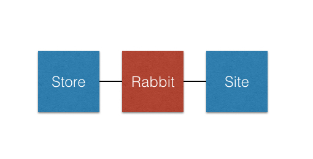
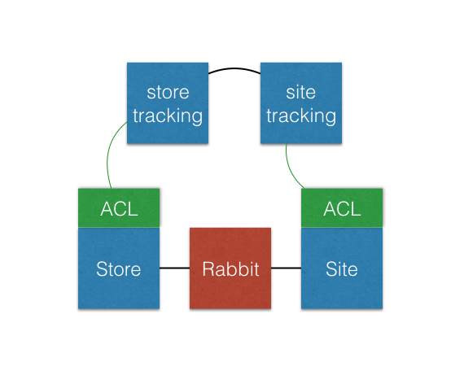
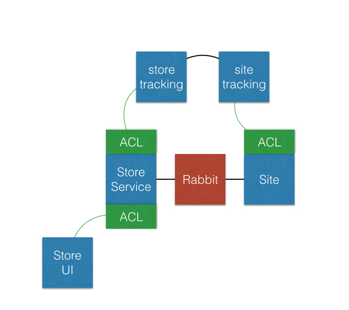
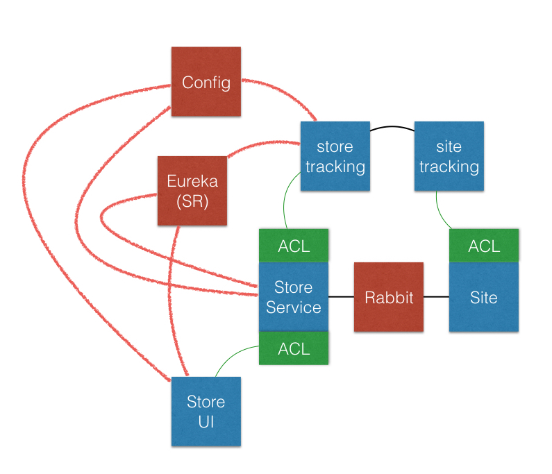

= A Tour of the Refactoring
:compat-mode:

== Starting Topology

== Step One: Independent Deployability

There's no real hope of having any sort of success with microservices as long as we're in the state where the same exact codebase must be deployed to run the website and to support managing individual stores. The eventual microservices we build will likely look very different in each context. So our first step is to create two independently deployable monoliths, each supporting a `common` shared library. The scope of the shared library gives us a real picture of just how tightly coupled the site and store code really are.

So in this stage we:

* Create a Gradle subproject structure: `common`, `store`, `site`.
* Refactor `build.gradle` to manage three subprojects, and we add `settings.gradle`.
* Parcel code out into the various subprojects.
* Fix compile errors and failing tests.

== Step Two: Finish an Existing Feature

We actually stopped work in progress when we completed Step One. A team has been laboring to finish up the order management screen for the stores, but has been unable to deliver due to churn on the website. Now that the applications are independently deployable, the store team can complete that UI feature and deploy it without waiting on the site team.

So in this stage we:

* Add a `StoreService` method, `orderDetails`.
* Add a `StoreController` method, `orderDetails`.
* Add a UI template, `orderDetails.html`.

== Step Three: Decouple the Contract between Site and Store

It was really easy to finish up that order details feature on the Store application. Unfortunately, the ease is deceptive. It was predicated on the fact that we are maintaining exactly the same DB schema, JPA domain model, and `OrderRepository` bewteen the two applications, all of this residing in the `common` project.

If you think about the responsibilities of the two applications, they're quite different:

* The Site application is charged with managing all of the various menu options and price combinations, as well as the customer address. It needs to have the full data model with all of its reference data to do this work.
* The Store application is charged with telling the stores what pizzas to prepare. We'll assume in this example that the store employees won't be editing these orders, just updating their status. So we don't need the full data model with all of its reference data. A denormalized representation of the exact order details will suffice!

So, we can break the contract by changing the messaging contract to only transmit the denormalized representation as JSON. This should eliminate the Store's dependency on the full JPA model and DB schema, and allow us to more fully decouple the applications.

So in this stage we:

* Implement a denormalized representation of the domain model as `OrderMessage`, `PizzaMessage`, etc.
* Implement `OrderTransformer` to convert the JPA model into the integration contract model.
* Introduce Spring Integration on both sides of the contract to facilitate the transformation and serialization of the model, as well as the AMQP orchestration.
* Eliminate the `common` project by inlining the JPA model and Spring Data repositories into the `site` project.
* Implement a lightweight JPA domain model in the `store` project.
* Convert the `store` UI to use the new lightweight domain model.

== Step Four: Implement Order Tracking Updates as Microservices

Now it's time to follow my guidance from _Migrating to Cloud-Native Application Architectures_ and implement new features as microservices. In this case, we'd like to implement order tracking updates. As a pizza order travels through the various stages of preparation in the store, we'd like our customers to be able to see these status updates on the website.

We don't want to introduce any additional couplings between the Site application monolith and the Store application monolith. Instead, we'll create a microservice on each side of the relationship, integrate those with the existing monoliths via an _anti-corruption layer_, and then integrate our new microservices with each other. At the stage we're going to keep things ``simple'' and not introduce any service discovery technology. Instead, we'll simply provide the addresses of each service as basic configuration properties.

New topology:

So in this stage we:

* Implement an Order Status UI in the Site Application.
* Build out an Incoming Order Status Update microservice, `site-tracking`, and add it as a Gradle subproject.
* Build an Anti-Corruption Layer in the Site Application. It is found in the `com.monolitospizza.acl` package, and consists of a facade, adapter, and translator, as defined in my book.
* Build out an Outgoing Order Status Update microservice, `store-tracking`, and add it as a Gradle subproject.
* Build an Anti-Corruption Layer in the Store Application. It is found in the `com.monolitospizza.acl` package, and consists of a facade, adapter, and translator, as defined in my book.
* Implement an Order Status Update UI in the Store Application.
* Fix a bug in the Store Application's JPA model that was not honoring incoming order numbers.

== Step Five: Separate Store UI from Store Service

It's time to begin strangling one of the monoliths. We'd like to separate the development of the UI for the store from the development of the store's microservices. We'll again use an _anti-corruption layer_, this time a simple facade that translates incoming HTTP requests into the current calls to `StoreService`. This facade forms the beginnings of a true API layer for Store operations. We move all of the UI related functionality into it's own microservice.

New topology:

So in this stage we:

* Create a new microservice, `store-ui`, and add it as a Gradle subproject.
* Move all of the MVC controllers and templates, and all of the MVC security configuration, to the `store-ui` project.
* Make the MVC controllers compile again by providing a domain model and service that makes outbound HTTP calls.
* Build an additional Anti-Corruption layer in the Store Application. It is also found in the `com.monolitospizza.acl` package, and consists only of a facade, `UiFacade`.
* Because we're not going to the trouble (for this exercise) of creating a model for the API, we need to add `@JsonIgnore` annotations to the inverse side of two JPA relations to prevent infinite recursion.

== Step Six: Integrate Store Microservices via Spring Cloud

Now that we have three separate microservices for the Store application side of things, it's becoming awkward to manage the integrations by manually passing addresses around. Fortunately we can leverage Spring Cloud to introduce distributed configuration management and service discovery (via Netflix OSS Eureka) to our architecture. This will allow us to refer to services by logical names rather than depending on fixed addresses passed in as static configuration.

New topology:

So in this stage we:

* Add a `config-server` Gradle subproject in order to provide a http://cloud.spring.io/spring-cloud-config/[Spring Cloud Config Server].
* Add `eureka` Gradle subproject in order to provide a http://cloud.spring.io/spring-cloud-netflix/[Spring Cloud Netflix Eureka Server].
* Update `build.gradle` to use Spring Cloud Brixton.M5 dependency management.
* Add `spring-cloud-starter-config` and `spring-cloud-starter-eureka` to the list of dependencies for each of the Store microservices.
* Add `@EnableDiscoveryClient` to each Store microservices to enable service discovery.
* Use a load balanced `RestTemplate` (powered by Spring Cloud Netflix Eureka Client and Ribbon) for communication.
